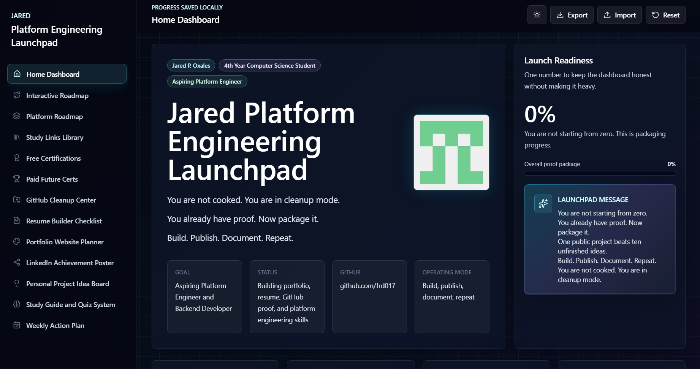
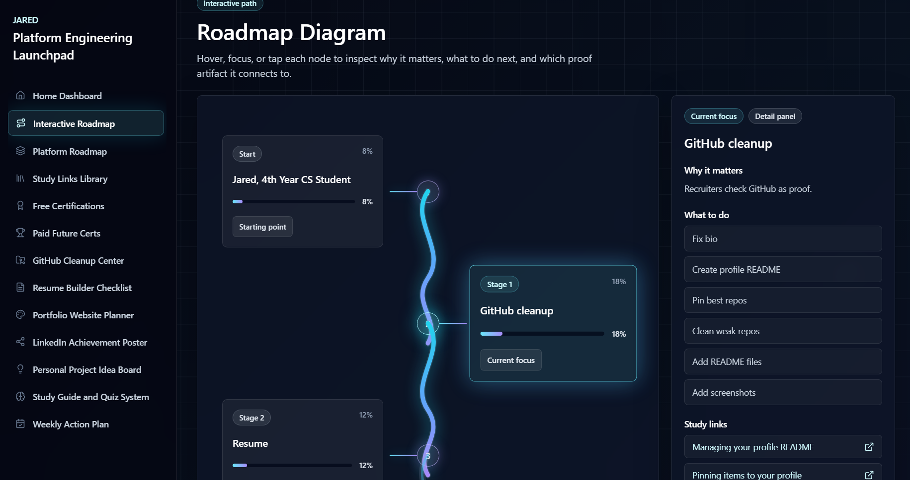
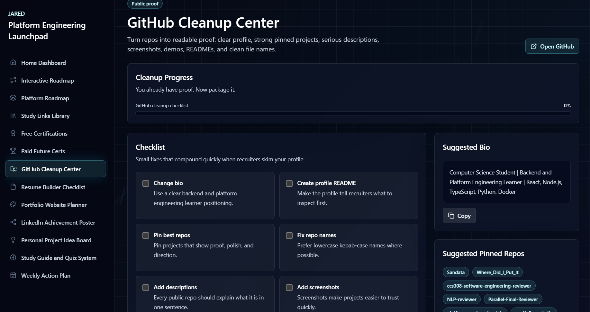
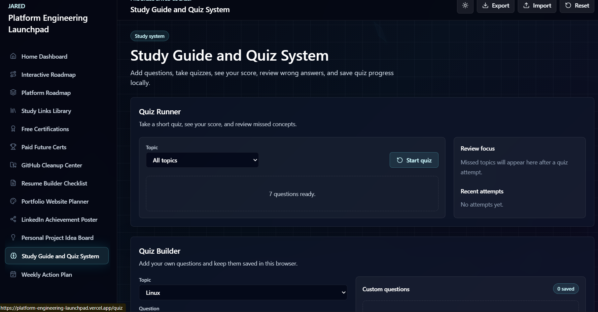

# Jared Platform Engineering Launchpad

A polished interactive career dashboard for organizing my path toward platform engineering, backend development, and developer tools work.

This project is built for Jared P. Oxales, a 4th year Computer Science student from TIP Manila. The goal is simple: turn existing academic projects, leadership experience, study progress, and project ideas into a clear public proof system.

> You are not starting from zero. You are packaging your proof.

## Why I Built This

I built this website because I needed a clear visual system for my learning path.

As a 4th year Computer Science student, I realized that having ideas, school projects, and goals is not enough if they are scattered. I needed one place where I could see my roadmap, track my progress, organize my project ideas, prepare my portfolio, and stay accountable.

This website is my personal career launchpad. It helps me visualize the path from software engineering foundations to backend development, Python automation, DevOps, infrastructure, and platform engineering.

The main purpose of this project is to turn pressure into direction. Instead of only thinking about what I need to learn, I can see it clearly, break it into steps, and track my progress.

This website helps me:

- Visualize my learning roadmap.
- Track my software engineering foundation.
- Organize my TypeScript and Python learning path.
- Plan my platform engineering journey.
- Monitor free certifications and study resources.
- Clean and improve my GitHub profile.
- Prepare my resume and portfolio.
- Store project ideas in one place.
- Stay consistent with weekly goals.
- Build proof of work for internships.

This project is also part of my portfolio. It shows that I can build a real interactive dashboard using Next.js, TypeScript, Tailwind CSS, and modern UI design while solving a personal problem.

The goal is simple:

Build. Publish. Document. Repeat.

## Project Overview

Jared Platform Engineering Launchpad is an all-in-one dashboard for tracking:

- Platform engineering study progress
- Python learning path, free certificates, practice, and projects
- Free and future certification plans
- GitHub cleanup tasks
- Resume readiness
- Portfolio website planning
- LinkedIn achievement drafts
- Personal project ideas
- Quiz and study guide progress
- Weekly action plans

Version 1 is intentionally frontend-only. It uses `localStorage` for saved progress and is structured so a backend can be added later.

## Python Learning Direction

This project now includes a guided Python learning path with tutorials, free certificates, free badges, practice websites, and Python project ideas. The path starts with Cisco Python Essentials 1, continues with CS50P, freeCodeCamp Python Certification, Kaggle Python, Cisco Python Essentials 2, then moves into FastAPI, pytest, pandas, automation, and backend projects.

## Main Languages

TypeScript:
Used for web apps, dashboards, frontend, backend APIs, and developer tools.

Python:
Used for automation, scripting, backend APIs, data work, AI support, and internal tooling.

## Responsive Design Status

The app is built with responsive layouts:

- Desktop uses a persistent left sidebar and wide dashboard panels.
- Tablet and smaller screens switch to a horizontal top navigation.
- Cards, roadmap panels, checklists, and forms collapse into narrower grids.
- Tablet and desktop checks currently show no horizontal page overflow on the main routes.
- The app is best showcased on desktop, but the structure is mobile responsive for version 1.

The screenshots below are desktop captures. Mobile screenshots can be added later after final spacing polish.

## Version 1 Scope Note

Some sections are intentionally draft/core-idea tools in version 1:

- The Personal Project Idea Board is a planning board, not completed project implementations.
- The LinkedIn Achievement Poster generates drafts only and does not post to LinkedIn.
- The Study Guide and Quiz System is a local prototype/core study idea, not a full production learning platform yet.
- ForgePanel, Platform Engineering Lab, and other project ideas are roadmap targets that will become separate proof projects later.

## Screenshots

Current desktop screenshots from the app:

### Home Dashboard



### Interactive Roadmap



### GitHub Cleanup Center



### Study Guide and Quiz System



## Features

- Dark glassmorphism dashboard UI
- Light and dark mode toggle with animated transition
- Animated floating geometric background elements
- Interactive vertical roadmap with hover, click, keyboard focus, and detail panel behavior
- Local progress saving with `localStorage`
- Export progress as JSON
- Import progress from JSON
- Reset progress with confirmation
- Platform engineering roadmap tracker
- Python Learning Path and Free Certifications page
- Searchable study links library
- Free certification tracker with badge and certificate URL fields
- Paid future certification planning section
- GitHub cleanup checklist
- README generator with copy button
- Resume builder checklist with readiness score
- Portfolio website planner
- LinkedIn achievement draft generator for copy-only posts
- Personal project idea board for core project concepts
- Local quiz builder and quiz runner prototype
- Wrong answer review and recent quiz attempt tracking
- Four-week action plan and daily checklist
- Mobile responsive layout

## Tech Stack

- Next.js
- React
- TypeScript
- Tailwind CSS
- Framer Motion
- Lucide React
- LocalStorage
- PNG and SVG screenshot assets

## Getting Started

### Prerequisites

- Node.js 20 or newer
- npm

### Setup

```bash
npm install
npm run dev
```

Open the app:

```text
http://127.0.0.1:3000
```

### Useful Scripts

```bash
npm run dev
npm run typecheck
npm run build
npm run start
```

## Sample Data

An importable sample progress file is included:

```text
content/sample-progress.json
```

To use it:

1. Start the app.
2. Click the `Import` button in the top-right navbar.
3. Select `content/sample-progress.json`.
4. Review the filled dashboard, checklists, certification fields, and quiz attempt history.

## Project Structure

```text
app/
  Main Next.js App Router pages and global styles.

components/
  Reusable dashboard, roadmap, checklist, generator, quiz, and layout components.

data/
  Typed content for roadmaps, Python learning paths, resources, certifications, GitHub tasks, resume tasks, projects, quizzes, and weekly plans.

lib/
  Progress state helpers and localStorage normalization.

content/
  Importable sample data and future content artifacts.

public/screenshots/
  README screenshots and placeholder visual assets.
```

## Roadmap

### Version 1

- Build the complete frontend dashboard.
- Save checklist and quiz progress locally.
- Add import and export progress.
- Add README and LinkedIn post generators.
- Add roadmap, certification, GitHub, resume, portfolio, project, quiz, and weekly planning sections.

### Version 2

- Add authentication.
- Add a real backend API.
- Store progress in a database.
- Add GitHub API integration for repo cleanup insights.
- Add downloadable resume templates.
- Add application tracking.
- Add real certification badge validation fields.

### Version 3

- Add ForgePanel as a connected project.
- Add deployment history from GitHub Actions.
- Add Docker and Kubernetes lab integration.
- Add observability demo dashboards.
- Add project case study pages.

## Deployment on Vercel

1. Push this project to GitHub.
2. Go to [Vercel](https://vercel.com).
3. Click `Add New Project`.
4. Import the GitHub repository.
5. Keep the default framework preset as `Next.js`.
6. Leave environment variables empty for version 1.
7. Click `Deploy`.
8. Add the deployed URL to your GitHub profile README, resume, LinkedIn, and portfolio.

### Production Build Check

Run this before deploying:

```bash
npm run typecheck
npm run build
```

## Future Improvements

- Add mobile screenshots after final responsive spacing polish.
- Add real project case studies for Sandata, Where Did I Put It, and ForgePanel.
- Add backend persistence.
- Add GitHub API powered repo audit suggestions.
- Add a resume PDF export workflow.
- Add user-defined roadmap phases.
- Add quiz import and export.
- Add internship application tracking.
- Add public share links for progress snapshots.
- Add analytics after deployment.

## GitHub Push Checklist

- Replace placeholder links with real GitHub, LinkedIn, resume, and portfolio URLs.
- Replace sample certificate URLs with real completed certificate links.
- Review all public copy for accuracy.
- Run `npm run typecheck`.
- Run `npm run build`.
- Commit with a clear message.
- Push to GitHub.
- Deploy to Vercel.
- Pin the repository on GitHub.

## Motivation

You are not starting from zero.

You already have proof. Now package it.

One public project beats ten unfinished ideas.

Build. Publish. Document. Repeat.

You are not cooked. You are in cleanup mode.
