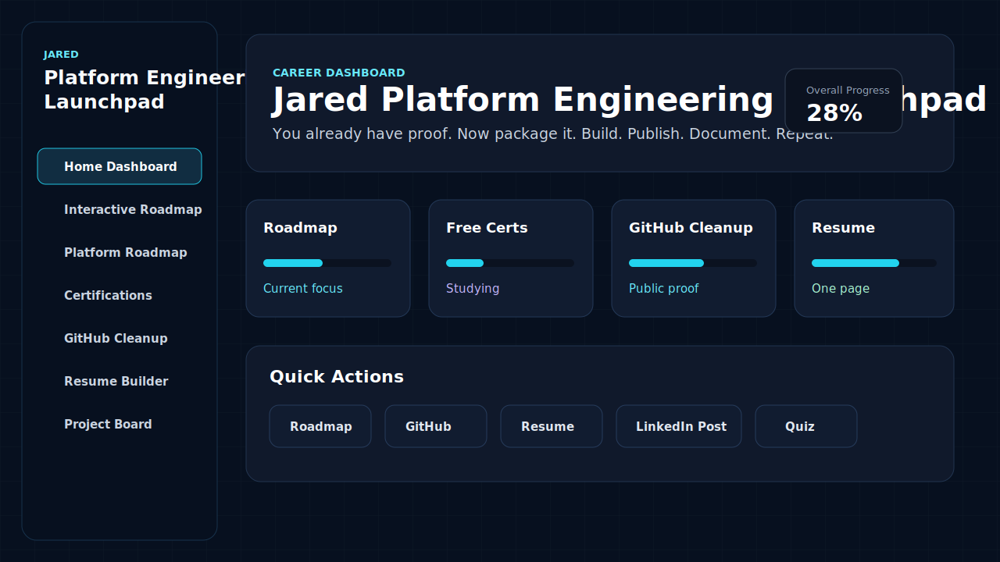
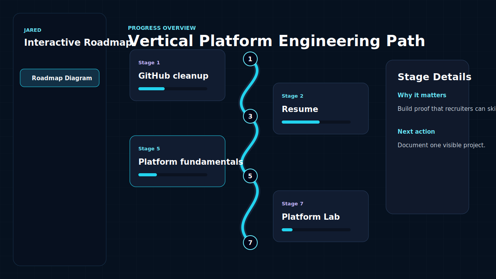
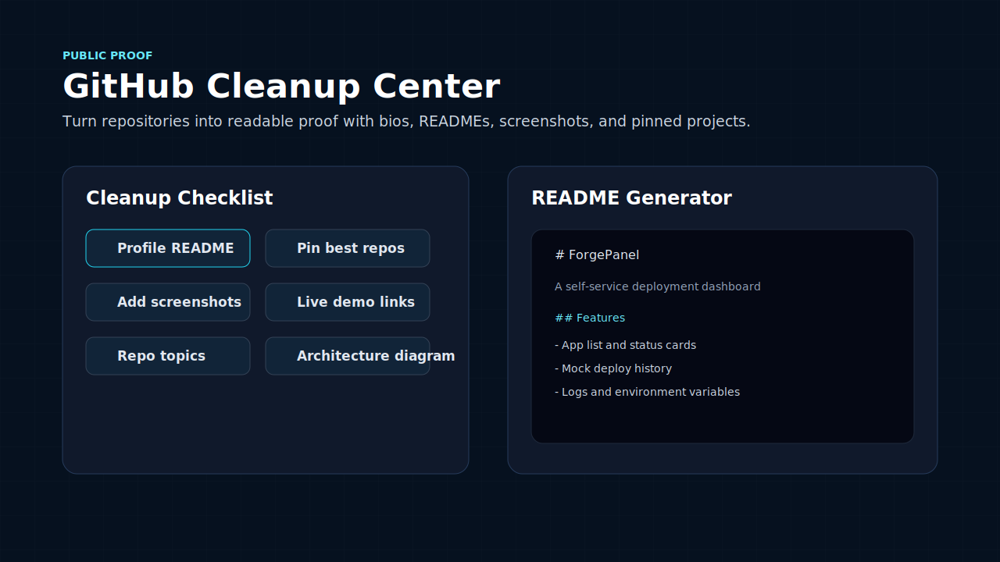
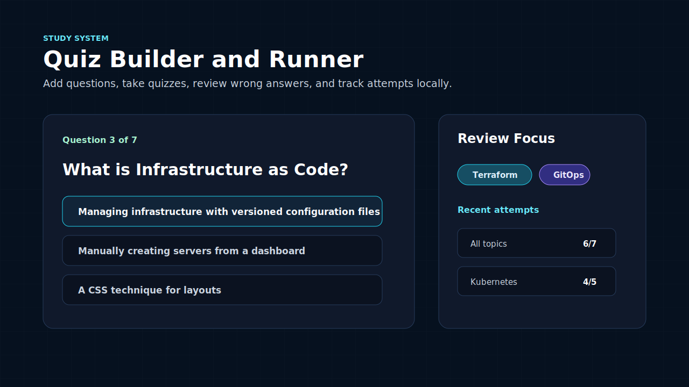

# Jared Platform Engineering Launchpad

A polished interactive career dashboard for organizing my path toward platform engineering, backend development, and developer tools work.

This project is built for Jared P. Oxales, a 4th year Computer Science student from TIP Manila. The goal is simple: turn existing academic projects, leadership experience, study progress, and project ideas into a clear public proof system.

> You are not starting from zero. You are packaging your proof.

## Project Overview

Jared Platform Engineering Launchpad is an all-in-one dashboard for tracking:

- Platform engineering study progress
- Free and future certification plans
- GitHub cleanup tasks
- Resume readiness
- Portfolio website planning
- LinkedIn achievement drafts
- Personal project ideas
- Quiz and study guide progress
- Weekly action plans

Version 1 is intentionally frontend-only. It uses `localStorage` for saved progress and is structured so a backend can be added later.

## Screenshots

These are real-looking placeholder screenshots for the first GitHub version. Replace them with actual deployed screenshots once the project is live.

### Home Dashboard



### Interactive Roadmap



### GitHub Cleanup Center



### Quiz System



## Features

- Dark glassmorphism dashboard UI
- Light and dark mode toggle with animated transition
- Animated floating geometric background elements
- Interactive vertical roadmap with hover, click, keyboard focus, and detail panel behavior
- Local progress saving with `localStorage`
- Export progress as JSON
- Import progress from JSON
- Reset progress with confirmation
- Platform engineering roadmap tracker
- Searchable study links library
- Free certification tracker with badge and certificate URL fields
- Paid future certification planning section
- GitHub cleanup checklist
- README generator with copy button
- Resume builder checklist with readiness score
- Portfolio website planner
- LinkedIn achievement draft generator
- Personal project idea board
- Quiz builder and quiz runner
- Wrong answer review and recent quiz attempt tracking
- Four-week action plan and daily checklist
- Mobile responsive layout

## Tech Stack

- Next.js
- React
- TypeScript
- Tailwind CSS
- Framer Motion
- Lucide React
- LocalStorage
- SVG placeholder assets

## Getting Started

### Prerequisites

- Node.js 20 or newer
- npm

### Setup

```bash
npm install
npm run dev
```

Open the app:

```text
http://127.0.0.1:3000
```

### Useful Scripts

```bash
npm run dev
npm run typecheck
npm run build
npm run start
```

## Sample Data

An importable sample progress file is included:

```text
content/sample-progress.json
```

To use it:

1. Start the app.
2. Click the `Import` button in the top-right navbar.
3. Select `content/sample-progress.json`.
4. Review the filled dashboard, checklists, certification fields, and quiz attempt history.

## Project Structure

```text
app/
  Main Next.js App Router pages and global styles.

components/
  Reusable dashboard, roadmap, checklist, generator, quiz, and layout components.

data/
  Typed content for roadmaps, resources, certifications, GitHub tasks, resume tasks, projects, quizzes, and weekly plans.

lib/
  Progress state helpers and localStorage normalization.

content/
  Importable sample data and future content artifacts.

public/screenshots/
  Placeholder screenshot assets for the README.
```

## Roadmap

### Version 1

- Build the complete frontend dashboard.
- Save checklist and quiz progress locally.
- Add import and export progress.
- Add README and LinkedIn post generators.
- Add roadmap, certification, GitHub, resume, portfolio, project, quiz, and weekly planning sections.

### Version 2

- Add authentication.
- Add a real backend API.
- Store progress in a database.
- Add GitHub API integration for repo cleanup insights.
- Add downloadable resume templates.
- Add application tracking.
- Add real certification badge validation fields.

### Version 3

- Add ForgePanel as a connected project.
- Add deployment history from GitHub Actions.
- Add Docker and Kubernetes lab integration.
- Add observability demo dashboards.
- Add project case study pages.

## Deployment on Vercel

1. Push this project to GitHub.
2. Go to [Vercel](https://vercel.com).
3. Click `Add New Project`.
4. Import the GitHub repository.
5. Keep the default framework preset as `Next.js`.
6. Leave environment variables empty for version 1.
7. Click `Deploy`.
8. Add the deployed URL to your GitHub profile README, resume, LinkedIn, and portfolio.

### Production Build Check

Run this before deploying:

```bash
npm run typecheck
npm run build
```

## Future Improvements

- Replace placeholder screenshots with real app screenshots.
- Add real project case studies for Sandata, Where Did I Put It, and ForgePanel.
- Add backend persistence.
- Add GitHub API powered repo audit suggestions.
- Add a resume PDF export workflow.
- Add user-defined roadmap phases.
- Add quiz import and export.
- Add internship application tracking.
- Add public share links for progress snapshots.
- Add analytics after deployment.

## GitHub Push Checklist

- Replace placeholder links with real GitHub, LinkedIn, resume, and portfolio URLs.
- Replace sample certificate URLs with real completed certificate links.
- Review all public copy for accuracy.
- Run `npm run typecheck`.
- Run `npm run build`.
- Commit with a clear message.
- Push to GitHub.
- Deploy to Vercel.
- Pin the repository on GitHub.

## Motivation

You are not starting from zero.

You already have proof. Now package it.

One public project beats ten unfinished ideas.

Build. Publish. Document. Repeat.

You are not cooked. You are in cleanup mode.
